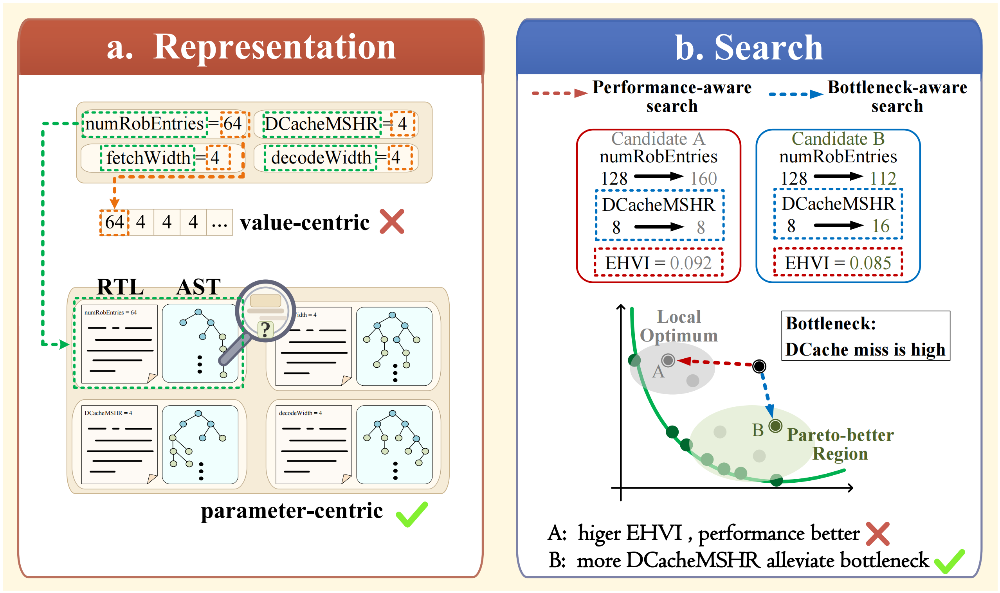
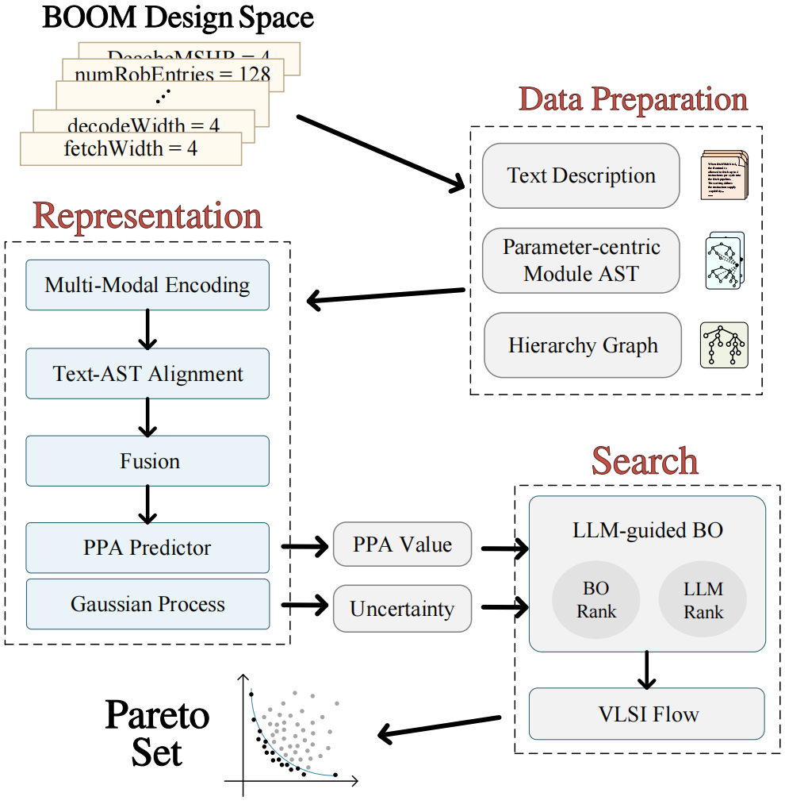

# PB-BO

PB-BO is a parameter-centric and bottleneck-aware Bayesian optimization framework for microarchitecture exploration.
The repository contains the complete executable artifact for the PB-BO offline BOOM DSE baseline and the minimal
inputs and scripts needed to rebuild its model-readable offline embeddings.

## Overview

PB-BO improves microarchitecture design space exploration from two complementary directions:
**parameter-centric representation** and **bottleneck-aware search**.

<p align="center">
  <a href="figures/intro.pdf">
    
  </a>
</p>

<p align="center">
  <b>Fig. 1.</b> Challenges in Existing Microarchitecture Exploration.
</p>

PB-BO replaces value-centric design encoding with parameter-centric encoding that explicitly associates
architectural parameters with their RTL/AST context. For search, it complements performance-aware Bayesian
optimization with bottleneck-aware LLM guidance to prioritize more promising design directions.

<p align="center">
  <a href="figures/overview.pdf">
    
  </a>
</p>

<p align="center">
  <b>Fig. 2.</b> Overview of PB-BO framework.
</p>

PB-BO combines parameter-centric multimodal representation, PPA prediction with uncertainty estimation,
and bottleneck-aware candidate re-ranking in a closed-loop microarchitecture exploration flow.

## Repository

- `pb-bo`: executable entry point.
- `dataset/offline.csv`: 4,997 configurations, 26 parameters, nine benchmark
  IPC values, aggregate IPC, power, area, and runtime.
- `dataset/static_features/`: fixed AST and hierarchy inputs that a flat CSV
  cannot encode.
- `scripts/`: the three core data conversion modules.
- `configs/build_offline_bo.json`: reproducible build configuration.
- `data/bert/`: trained 128-dimensional BERT adapter and prompt.
- `data/offline_bo/`: ready-to-use model inputs.
- `data/raw/` and `data/checkpoints/`: runtime data and trained PB-BO model.
- `outputs/`: retained reference results.

## Environment

Use Python 3.10+ and install the complete runtime and data-builder
dependencies from the single requirements file:

```bash
pip install -r requirements-data.txt